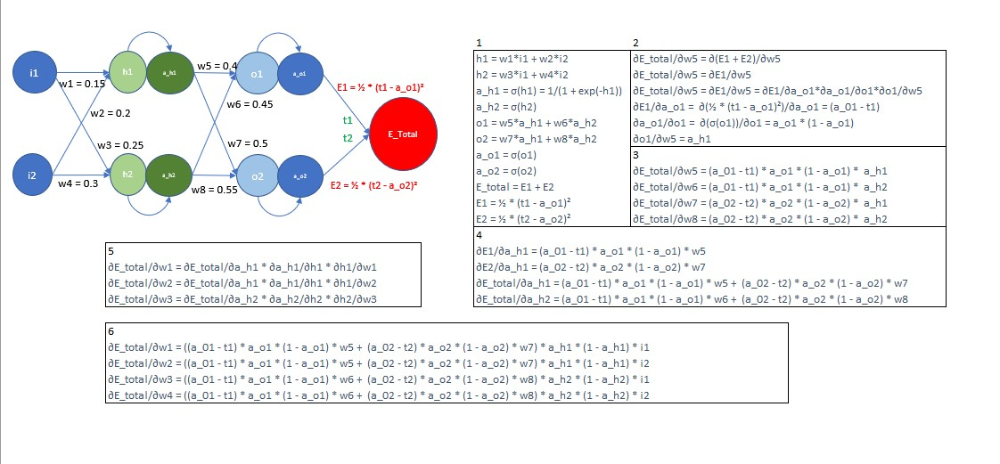
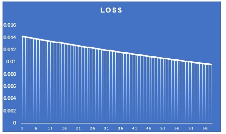
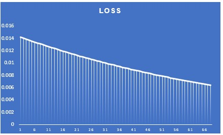
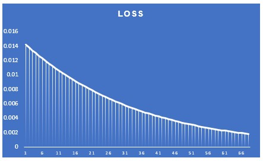
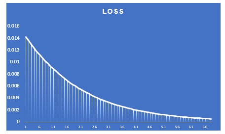
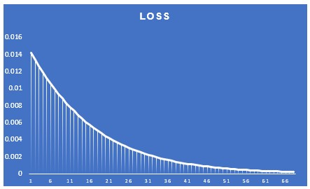
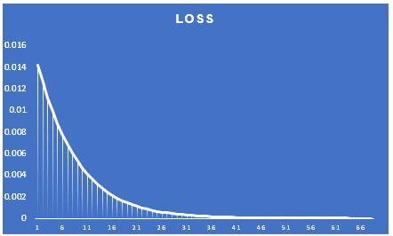

# ERA_V1_Session_6

## PART 1
Here we calculate backpropogation equations by hand for a small network as given below

- The excel sheet with the calculation is present [here](S6/backprop.xlsx)

Below is the loss function graph when training the above neural network for different learning rates:
- `Learning Rate = 0.1`\

- `Learning Rate = 0.2`\

- `Learning Rate = 0.5`\

- `Learning Rate = 0.8`\

- `Learning Rate = 1.0`\

- `Learning Rate = 2.0`\

Observation:
As we can see from the above graph, with increase in learning rate, the loss reduces faster i.e the neural network given above is able to converge quickly.
However, this is a very simple model. Selecting an appropriate learning rate is crucial for successful model training, and being cautious in this choice
can help avoid issues such as slow convergence, unstable dynamics, poor generalization, and getting stuck in suboptimal solutions.

## PART 2
Here we write an MNIST classifier model with following constraints:
- 99.4% validation accuracy
- Less than 20k Parameters
- You can use anything from above you want. 
- Less than 20 Epochs
- Have used BN, Dropout,
- (Optional): a Fully connected layer, have used GAP.

- Code for this is present [here](S6/ERA_Session_6.ipynb)

